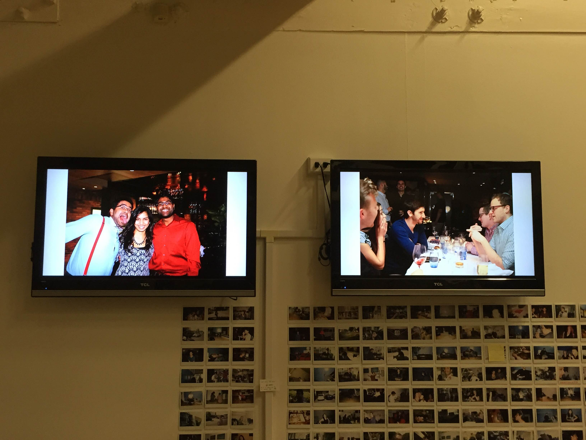

# CastPics

Turn your Chromecast displays into a digital picture frames.

## Setup and configuration

Setup and install dependencies with `./setup.sh`

Start the program with `./run.sh <images_directory>` where `images_directory`
is a directory containing the images you would like to display. The application
will then be available at `http://127.0.0.1:8989/`. Open this in Chrome,
and mirror your Chrome tab to your Chromecast.

## Behavior

Wondering what images are selected?

The app will recurse the directory provided and look for the 100 most recent
pictures. Of those 100, it will randomly display a different one every minute.
For maximum fun, consider making an
[AeroFS shared folder](https://aerofs.com) the source of your images, and share
that folder with your friends, or your colleagues.

## In a perfect world...

In a perfect world [`pychromecast`](https://github.com/balloob/pychromecast)
or others would have a nice way to cast a simple webpage to a given Chromecast.
Sadly this is not the case, so opening a tab and setting up mirroring is
required for now.
